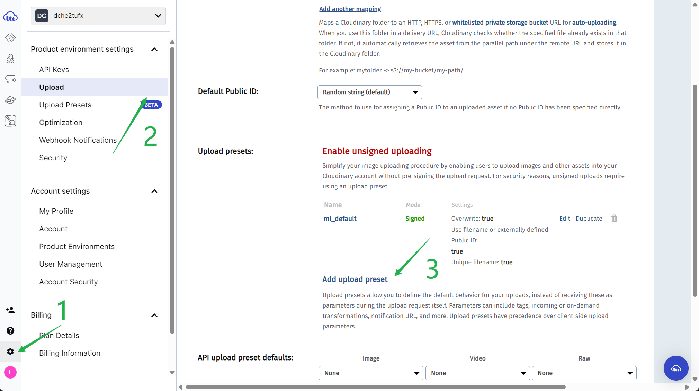
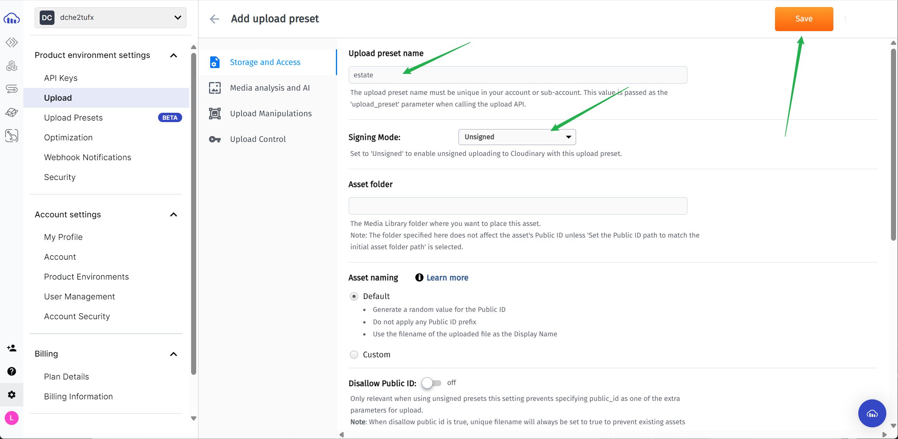
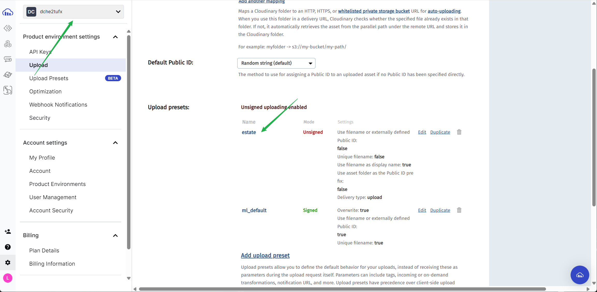

# 修改用户信息

1. 设计 user api，用于修改用户信息

```js
// 在route 中添加：
router.put("/:id", verifyToken, updateUser);

// 在 controller 中添加：
// 1. 得到参数中的 id
// 2. 获取 验证token 这一中间件中的 userId
const id = req.params.id;
const tokenUserId = req.userId;
// 3. 确认一致，进行操作，有密码，先对密码加密，再把req.body中的信息，更新到数据库。
const { password, avatar, ...inputs } = req.body;
if (password) {
  updatedPassword = await bcrypt.hash(password, 10);
}
const updatedUser = await prisma.user.update({
  where: { id },
  data: {
    ...inputs,
    ...(updatedPassword && { password: updatedPassword }),
    ...(avatar && { avatar }),
  },
});
```

2. 修改 updateProfile ，添加 handleSubmite 操作

3. 对于头像图片，上传、存储、管理、优化和分发图像，我们使用 Cloudinary SDK，具体使用教程如下：

- 复制官网的 widget 添加到本地组件中，[查看详情](https://cloudinary.com/documentation/react_image_and_video_upload)
  它封装了所有必要的代码和用户界面，我们可以轻松地将其集成到自己的应用中

- 注册登录，管理该 SDK，进行配置
  步骤一：
  
  步骤二：
  
  步骤三：
  

- 在代码使用刚刚复制的 widget，并设置配置参数

```jsx
<UploadWidget
  uwConfig={{
    cloudName: "dche2tufx",
    uploadPreset: "estate",
    multiple: false,
    maxImageFileSize: 2000000,
    folder: "avatars",
  }}
  setAvatar={setAvatar}
/>
```

- 查看 initializeCloudinaryWidget，得到的结果
  它会输出 result.info，其中可以看到图片的上次得到的地址为，secure_url
  使用这个 secure_url，设置 setAvatar(result.info.secure_url)

```js
console.log("Done! Here is the image info: ", result.info);
setAvatar(result.info.secure_url);
```

4. 添加 avatar ，一并返回到后端
